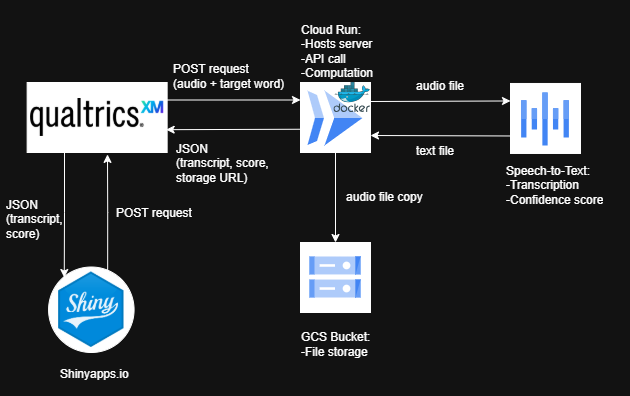

# Qualtrics Audio Processing Pipeline

A real-time audio processing pipeline that integrates Qualtrics XM web surveys with Google Cloud Platform services to capture, transcribe, and score spoken responses.

## Overview

This pipeline collects spoken responses through Qualtrics surveys and automatically processes them in real-time using GCP services. The system provides an affordable alternative to Qualtrics' audio storage subscription by handling storage, transcription, and analysis on Google Cloud.

## How It Works

**Frontend:** Qualtrics XM handles the web survey interface and audio recording capabilities.

  

**Backend:** A GCP cloud server processes incoming API calls from Qualtrics and performs three main operations:

1. **Audio Storage** - Saves audio recordings to a GCP Cloud Storage bucket and returns a URL to Qualtrics for administrator review.

2. **Speech Transcription** - Sends audio files to GCP's Speech-to-Text API for transcription. Returns the transcribed text along with a confidence score for quality control purposes.

3. **Proximity Scoring** - Calculates how close the transcribed response is to a target word using Levenshtein distance. The score is computed as: `(1 - levDistance / maxLen) × 100` where maxLen is the maximum length between target and transcribed words.

  

**Monitoring Dashboard:** A Shiny application provides real-time visualization of survey responses for administrators.

4. **Data Visualization** - The Shiny dashboard makes API calls to Qualtrics to fetch response data in JSON format and displays:
   - Word cloud of transcribed responses
   - Distribution of proximity scores
   
   The dashboard is hosted on Shinyapps.io, providing a more flexible and user-friendly alternative to Qualtrics' built-in visualization tools. Note that the application loads on-demand when the URL is visited, which may result in initial loading delays as it fetches and processes data.

  

## Key Features

- Real-time audio processing without expensive Qualtrics storage fees
- Automated transcription with confidence scoring for quality control
- Proximity scoring to evaluate response accuracy
- Extensible design that can accommodate alternative transcription services or LLM-based analysis

## Technology Stack

- **Frontend:** Qualtrics XM
- **Cloud Platform:** Google Cloud Platform (GCP)
- **Storage:** GCP Cloud Storage
- **Transcription:** GCP Speech-to-Text API
- **Scoring:** Levenshtein distance algorithm
- **Visualization Dashboard:** Shiny (hosted on Shinyapps.io)

## Future Considerations

The pipeline could be enhanced by integrating LLM models to better handle natural speech patterns (e.g., recognizing correct answers in phrases like "I'm not sure, but I think the answer is X"). However, this may introduce additional latency that could impact user experience.
